<p align="center">
  
</p>

<p align="center">
  <strong>⚡ Next-Gen Modular Animated SVG Profile & CV Engine for GitHub</strong>
</p>

<p align="center">
  <a href="https://gitflex.dev"></a>
  <a href="https://github.com/SwomSanchez/GitFlex"></a>
  <a href="https://github.com/SwomSanchez/GitFlex/stargazers"></a>
</p>

---

### 🚀 Two Ways to Flex Your GitHub Profile

#### 1. 🌐 No-Install Cloud Web Studio (Instant & Auto-Synced)
Design your animated card in our live visual editor and get an auto-updating link:
👉 **[Launch GitFlex Web Studio](https://gitflex.dev)**

Add this to your GitHub `README.md`:
```markdown
[](https://gitflex.dev)
```

---

#### 2. 💻 Interactive Terminal CLI
Run it locally with a single command to generate autonomous GitHub Action workflows:

```bash
# Clone and run setup wizard
git clone https://github.com/SwomSanchez/GitFlex.git
cd GitFlex
pip install -r requirements.txt
python main.py
```

---

### ✨ Features

- 🌌 **Cyberpunk & Obsidian Themes:** Handcrafted gradient shaders and floating particle systems.
- 🎰 **Odometer Animated Counters:** Slot-machine rolling numbers for Stars, Forks, and Followers.
- 📊 **Dynamic Language Bars:** Real-time percentage breakdowns calculated directly from your public repositories.
- 🛠️ **100+ Devicon Tech Badges:** Showcase your true tech stack with high-resolution vector icons.
- ⚡ **Auto-Deploy GitHub Actions:** Runs every 24h autonomously via GitHub CI/CD workflows.

---

### 🎨 Themes Included

| Theme | Preview Vibe |
| :--- | :--- |
| **Cyberpunk Nebula** | Deep space aesthetics with purple & neon green auroras |
| **Midnight Sapphire** | Oceanic blues with electric cyan high-tech glow |
| **Sunset Crimson** | Warm dusk gradients with vibrant pink & golden amber |
| **Matrix Emerald** | Cyberpunk terminal black with neon emerald matrix |

---

### 🤝 Contributing & Support
Give a ⭐️ if this project helped you flex your GitHub profile!  
Created with passion by **[SwomSanchez](https://github.com/SwomSanchez)**.
